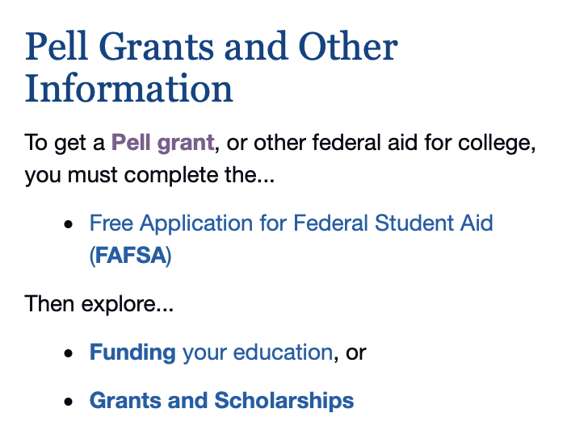

# Public Spaces Impacted by COVID-19
## DH150 Assignment 1: Heuristic Evaluation by Natalie Tang

Over 170 countries across the globe have confirmed cases of coronavirus. In the United States, 41 states are under mandatory stay-at-home orders and life as we knew it dramatically changed around mid-March. The commute to work looks much different now from what it once was. Students from elementary schools all the way to the university level are now completing school online and at home. Over 6 million people have filed for unemployment. People are rallying support for small businesses that will be heavily impacted by forced closures and decreasing sales. I have chosen to evaluate two public spaces that have been affected by the coronavirus--the department of education and the minority business development agency. As a result of this ongoing pandemic, the education system has had to quickly adapt to become accessible to all kids and adults from home which requires new technology, new teaching methods, etc. Similarly, small businesses owners/workers have been more heavily impacted by COVID-19 than larger, chain stores. Small businesses have become more creative to try and boost sales or are forced to close down altogether. I am specifically focusing on minority business because people of color are disproportionately impacted by the coronavirus which would, in turn, affect minority businesses. 

### Website 1: U.S. Department of Education
https://www.ed.gov

The Department of Education (ED) exists to "promote student achievement" by ensuring equal access and encouraging educational excellence. To do this the ED (1) oversees and distributes federal education funding, (2) collects data and conducts research on schooling in the U.S., (3)identifies and draws attention to major educational issues and (4)enforces federal regulations prohibiting discrimination in programs that recieve federal funding. 

The opening page of the department's website is standard and includes four main headings that relate to the four action items that ED is responsible for that were listed above--student loans, grants, laws, and data. There are pictures below the main headings with the exact same titles which are redundant and unecessary. Overall, I would say that this website is very cluttered and does not have a clear focal point. The structure of the website, however, is simple which makes it easy for a user to navigate. 

### Website 2: Minority Business Development Agency (MBDA)
https://www.mbda.gov

The Minority Business Development Agency was created by the U.S. Department of Commerce and aims to promote growth of minority businesses whith the use of different programs, policies, and research. The Agency has created many centers that facilitate this growth by providing assistance services to Minority Business Enterprises (MBEs). 

The website opens to a rotating highlight reel with a prominent heading of "loans and grants" directly below it. It also features the latest news/tweets concerning minority businesses as well as where to locate one of their centers, more about the inclusive innovation initiative, and access to the agency's research library that has statistics on minority businesses in the United States. The menu bar is tucked away in the far right corner and opens in a way that is not standard to most websites. Due to the positioning of the menu bar, the user is led to focus more on the center of the page and the heading in tiny font that reads, "NOW OPEN: Nevada and New Mexico MBDA Business Center Grant Competitions." Overall, the website looks very sleak but is not organized in the most functional manner. 

## Heuristic Evaluation Severity Scale

1 = low priority, cosmetic problem only

2 = should be given attention if the correct resources and enough time are available, causes a minor usability problem

3 = requires immediate attention, causes a major usability problem

## Website 1 Heuristic Evaluation - ED
### 1. Visibility of System Status
- This website does its best to let users know what is happening. When the user hovers over a clickable link the text becomes underlined or turns a different color to make the user aware that they click to visit a different part of the website. However, the featured portion of the mainpage has clickable headings and pictures but the user is not made aware that these are, in fact, clickable because nothing becomes underlined or changes color. Severity Rating (1)

### 2. Match Between System and the Real World
- The homepage of the Department of Education features four main titles that are accompanied by pictures that should aide the user in understanding the main title. Some of these pairings make sense like the association of "Student Loans" with a picture of a graduate. Other heading and picture pairings do not match real world expectations or make logical sense. For example, "Grants" are pictured with a small gathering and "Laws" are pictured with a child. These seemingly have nothing to do with each other and can potentially confuse the user about what these links may lead to. Severity Rating (2).

- The website does a good job overall at speaking the user's language and not using foreign or difficult terminology. Even first time users would be familiar with terms like "loans" or "laws" and in the event that they are not the website offers a short description of the main titles below their pictures. 

### 3. User Control and Freedom 
- The four main, clickable headings of this website are obscured from the users view anytime the user scrolls further down the page. This could potentially prevent the user from freely accessing other portions of the website. This could be solved by allowing the four main titles to show at all times (even when scrolling) or by providing a "back to the top" button. Severity Rating (1) 
- Overall, there are no major issues here as the user can utilize the back button to "undo" any incorrect movements along the site. This website also provides a "cancel" button when a user attempts to subscribe to their email service in case it was a mistake. 

### 4. Consistency and Standards
- Typically words in blue colored font are known to be clickable links, especially if the wording is both blue and underlined. On this website, there are many instances where there is blue font that is not a clickable link. This is confusing for users because it does not match typical expectations. Severity Rating (3)

- At the very bottom of the website each of the four main headings have various subheadings listed below them. These subheadings do not appear when the user hovers over the four main titles at the top of the page via a drop down bar or something of that nature. The subheadings are helpful in guiding users to specific locations on the website and this lack of consistency only negatively impacts the user. Severity Rating (2)

### 5. Error Prevention
- Many of the links on this website lead to outside websites (e.g. FAFSA). Users can mistakenly click on something that leads them off of the ED website to a completely different website without being notified first. This could be prevented with a pop-up message that asks the user if they are sure that they want to leave this page to visit another. Severity Rating (3) 
- The search feature does not offer autofill options that can prevent users from misspelling words and offer suggestions. The website does, however, attempt to correct misspelled words after the search is complete. Severity Rating (1)

### 6. Recognition Rather Than Recall
- Traditionally, links that have already been viewed or clicked turn purple to let the user know that they have already visited a certain link. This allows the user to recognize which links they have already clicked rather than have to individually recall them and prevents confusion. However, on this website this only occurs with certain links meaning that only some links that have been clicked on will turn purple. For example, I clicked on every link in the picture below; however only one link turned purple. Severity Rating (2)

- There is no search history or "recently viewed" options available to users that may need to look back at their recently viewed pages/documents. This makes it much harder on the user because they will be forced to try to remember the exact page that they were viewing. This is a completely necessary tool for a website like the Department of Education because there are so many different links available to the user on every single page. Severity Rating (3)

### 7. Flexibility and Efficiency of Use
- As previously mentioned, this website lacks a "back to the top" option that would increase the site's overall efficiency and ease of use. Severity Rating (1)
- There is an option in the upper right corner that allows the user to "Skip to Main Content." This seems to be an attempt by this website to improve efficeincy; however, it only scrolls past the website headers (this includes the main four headings). This seems rather pointless and can be confused for a main or home page by the user. Severity Rating (2)

### 8. Aesthetic and Minimalist Design
- The design of this website is very basic which makes it easy for users to navigate. The site is not very aesthetically pleasing but is functional. There is a lot of unnecessary repitition that seemingly makes the website feel cluttered. The titles and subsequent text beneath the titles could be better organized in a way that does not overwhelm the user with lots of different links. Severity Rating (1)
- Similarly, the main page does not have a main focus point. The featured articles and resources remain hidden at the bottom of the page and would be better placed as a focus point on the main page perhaps as sliding titles. Severity Rating (1)

### 9. Helps Users Recognize, Diagnose, and Recover from Errors
- On the email subscription sign up page, the website recognizes any missing information and informs the user to fill out all spaces with an asterisks. It does not screen for errors entered manually by the user. For example, the submission of a fake_email@fakewebsite.com is an acceptable email address. Severity Rating (2). 
- When using the search bar there is an autofill option that only shows up on the individual search site and does not appear while searching on the homepage of the ED website. Autofill options are helpful to users and prevent them from having spelling errors. This inconsistency makes it more difficult for users to navigate the website. Similarly, the search site does not offer suggestions if something is misspelled (e.g. Did you mean ___ ?). This feature would help users recover from possible errors and save them time from having to retype their question. Severity Rating (2).

### 10. Help and Documentation
- There is a frequently asked questions page that features the answers to over sixteen main topics all that have four or more subtopics. There is no option to choose the main heading which forces the user to scroll past 16+ topics to find their topic of interest. Severity Rating (2)

- This website also features a "Contact Us" page that lists the main headings as a clickable link at the top of the page so that the user can easily obtain the contact information for a particular department. This way, the user does not have to scroll past the long lists of contact information to find their department of interest. 

## Website 2 Heuristic Evaluation - MBDA
### 1. Visibility of System Status
- Hovering over any links or pictures on this website causes background movement and/or the arrow colors will change in order to signal to the user that they are about to move to a different part of the website if they proceed. However, some arrows turn red when they are hovered over while others do not. Similarly, any option in the drop-down menu bar does not change color or move when the mouse is hovering over it. These inconsistensies can confuse the user and lead them to wrong parts of the website because the user's actions are not being communicated properly. Severity Rating (1)

### 2. Match Between System and the Real World
- This website uses typical business language such as "private equity and venture capital sourcing" which may seem acceptable given this website is geared towards people who own businesses. On the contrary, this can actually discourage people who are not farmiliar with these terms from starting a business which is counterproductive to the goal of the MBDA. Severity Rating (1)
- Similar to when you meet a new person, users may be expecting some sort of general introduction to what the SBDA is/does on the openning page. Currently, the home page focuses on featured, relevant highlights and loans & grants. Although there is an "About" page located in the drop-down menu, it would be valuable to add at least a sentence or short statement somewhere on the home page so that first-time users will not feel flustered when using this website. Severity Rating (2) 
- This website has done a good job at matching icons to their respective titles which would be consistent with user expectations. For example, the title "Find a Business Center" is paired with an office building icon and the title "Research and Data" is paired with a graph and folder icon. 

### 3. User Control and Freedom 
- If the user selects any icons/links that lead the user outside of the MBDA's website a new tab is opened. For example, if a user selects share to facebook a new tab will open with a proposed facebook message. Typically, I find it much more convenient if I can just click the back button as opposed to closing out a whole new tab. Severity Rating (1)
- The drop-down menu bar does not remain visible to the user at all times as it disappears the further down the user scrolls. This prevents users from easily accessing other parts of the website and can make the user feel trapped. Severity Rating (2)
- This website supports user control and freedom by providing a "cancel" button when subscribing to their email service. 

### 4. Consistency and Standards
- When a search is completed on this website the entire layout changes -- the font, the phrasing, the format, etc. This is extremely confusing from the user's perspective because the website looks unrecognizable from the home page but maintains the same functionality. Severity Rating (3)

- In the data visualization section of the website there is a downward arrow next to the title "State/US" that realphabetizes the list of states. However, arrows in this format signal that you can collapse or expand a long list (like a list of states). This is confusing for a user because it will not match their expectations. Severity Rating (2)

- Typically, websites feature visible and clickable headings across the length of the top page that are part of the "menu." The MBDA website opted for non-visible menu titles that only become visible once the user locates and clicks the menu side-bar. This impacts the user's experience because it deviates from standard expectation in a way that is not logical or functional. Similarly, it leaves a large top portion of the website blank that user's typically expect to be filled with guiding titles. Severity Rating (3)

### 5. Error Prevention
- If a user clicks a link that leads to an outside website such as facebook, instagram, or twitter they are not notified that they will be leaving the page. A pop up message that asks the user if they are sure they want to leave the page would prevent users who accidentally click links or icons from getting frustrated by unnecessary redirections. Severity Rating (1)
- The search feature does not offer autofill options that can prevent users from misspelling words and offer suggestions. The website does, however, attempt to correct misspelled words after the search is complete. Severity Rating (1)
- Links turn purple after they have been clicked on which prevents the user from getting confused about links that they have or have not clicked on. 

### 6. Recognition Rather Than Recall
- There is no search history available to users that may need to look back at their recently viewed pages/documents. This makes it much harder on the user because they will be forced to try to remember the exact page that they were viewing. Severity Rating (3)
- The titles that are located in the menu bar do not appear at all times. If the user wants to visit a different part of the website they must click on the menu bar to reveal the different options. The menu bar is only located at the top right of the page which makes it harder for the user that has scrolled to the bottom of the page. If the titles in the menu bar were listed and "frozen" to the top of the page the user would not have to try to recall menu titles when they are at different parts of the website. Severity Rating (3)
- This website successfully utilizes recognition over recall by offering a drop down list of filters when trying to find different site locations and data. 

### 7. Flexibility and Efficiency of Use
- In the data visualization section of this website there is an option to filter different characterstics of MBEs (e.g. industry, firm ownership, year). The results of the filtered data cannot be saved, the only option is to download the data in its entirety via a csv file. This makes the filter option practically useless and inefficient because it cannot be saved in a way that is useful for the user. Severity Rating (2)
- The MBDA website is made more efficient by providing users with a "back to the top arrow" that appears if the user scrolls down the page. 

### 8. Aesthetic and Minimalist Design
- For the most part the design of this website is aesthetically pleasing and minimalistic which makes it easier for users to navigate. However, the colors on the openning page do not complement each other which causes a visual clash. This is apparent when comparing the highlight reel to the section below it - an overpowering pink color is contrasted with blue along with blue on blue that does not provide enough contrast. Severity Rating (1).

- Another problem is how the users attention is drawn to the heading "Loans and Grants" that apppears in larger font than any of the featured topics. This is likely caused by a lack of guidance because the menu options are not present at the top of the page. Severity Rating (1).  

### 9. Helps Users Recognize, Diagnose, and Recover from Errors
- On the email subscription sign up page, similar to the ED website, the MBDA's website recognizes any missing information and informs the user to fill out all spaces with an asterisks. It does not screen for errors entered manually by the user. For example, the submission of a fake_email@fakewebsite.com is an acceptable email address. Severity Rating (2). 
- After the search of a misspelled word or phrase is completed the engine automatically corrects to the predicted word or phrase. This saves the user's time so that they do not have to redo their whole search due to a spelling mistake. 

### 10. Help and Documentation
- There is no "Help" or "Frequently Asked Questions" section of this website. This is a huge problem because it offers no guidance to first time users. There is a place to provide feedback under the "tools and resources" tab but this is not a designated place for asking questions. It is unclear whether or not this feedback page is a place for asking questions because it says that it is a place for "comments, suggestions, and pointing out mistakes." Severity Rating (3) 
