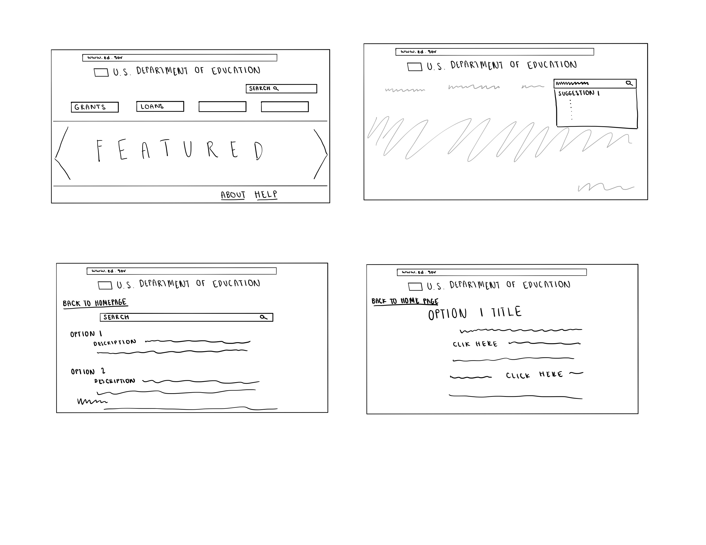
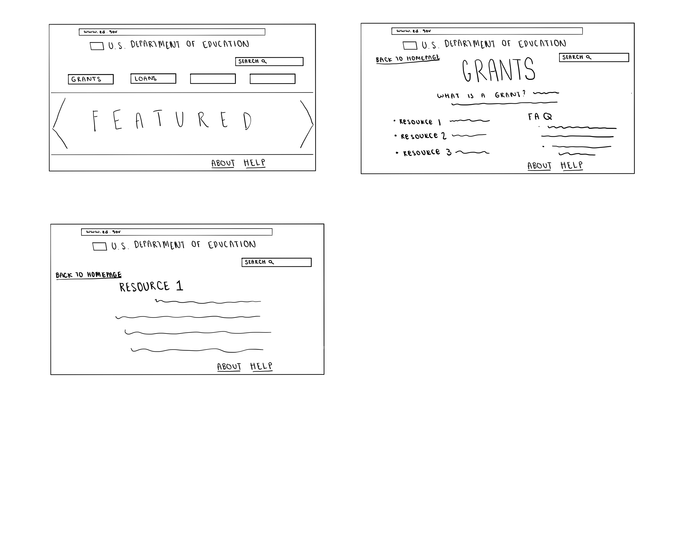
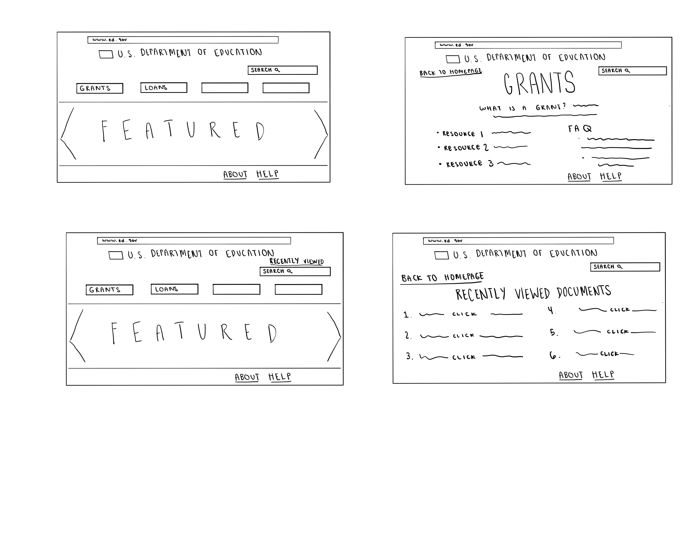
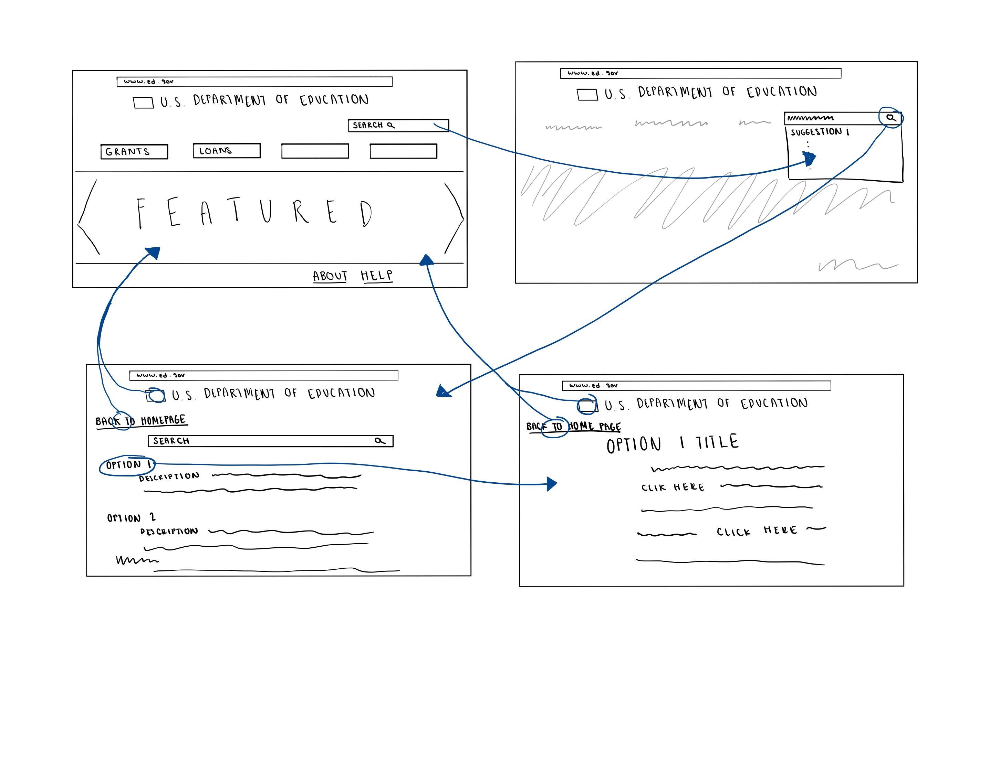
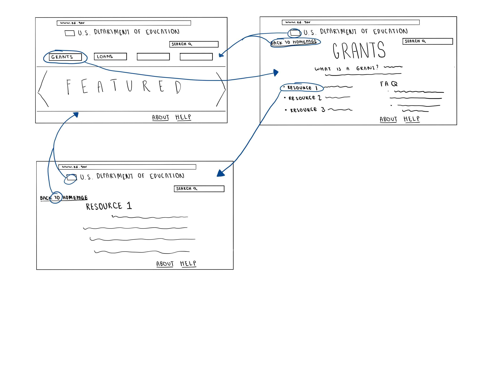
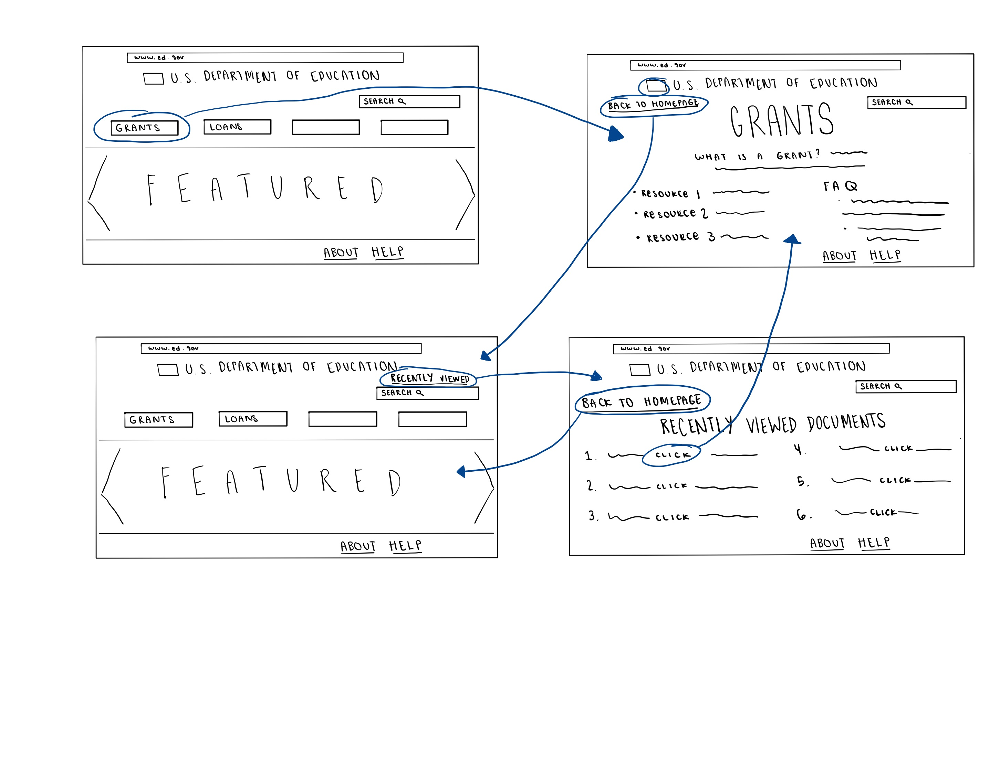
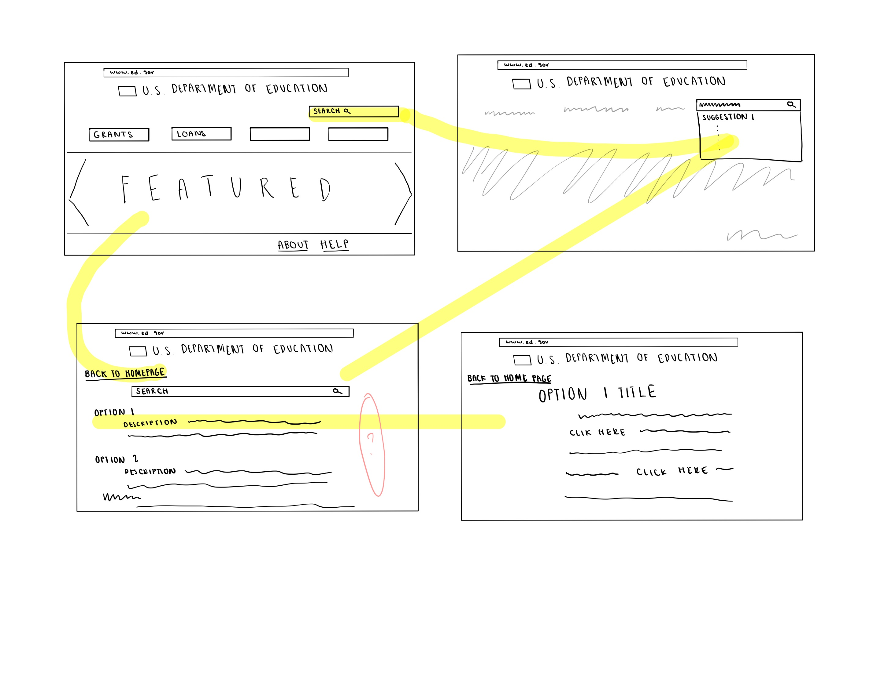
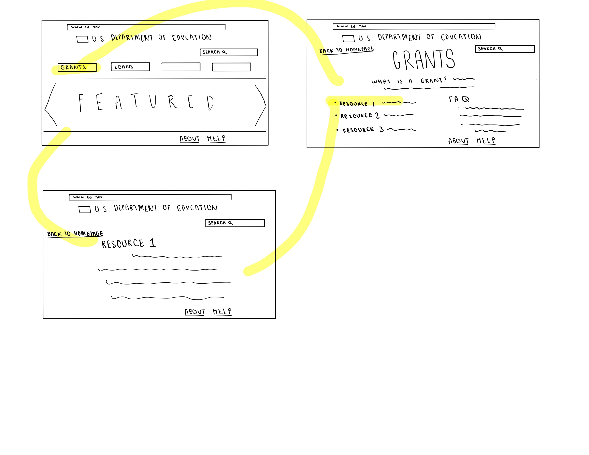
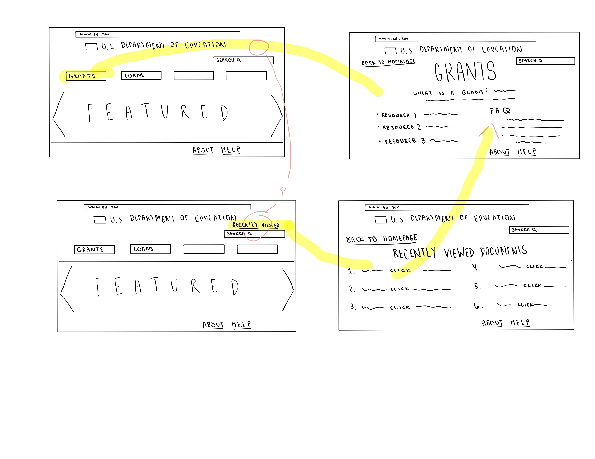
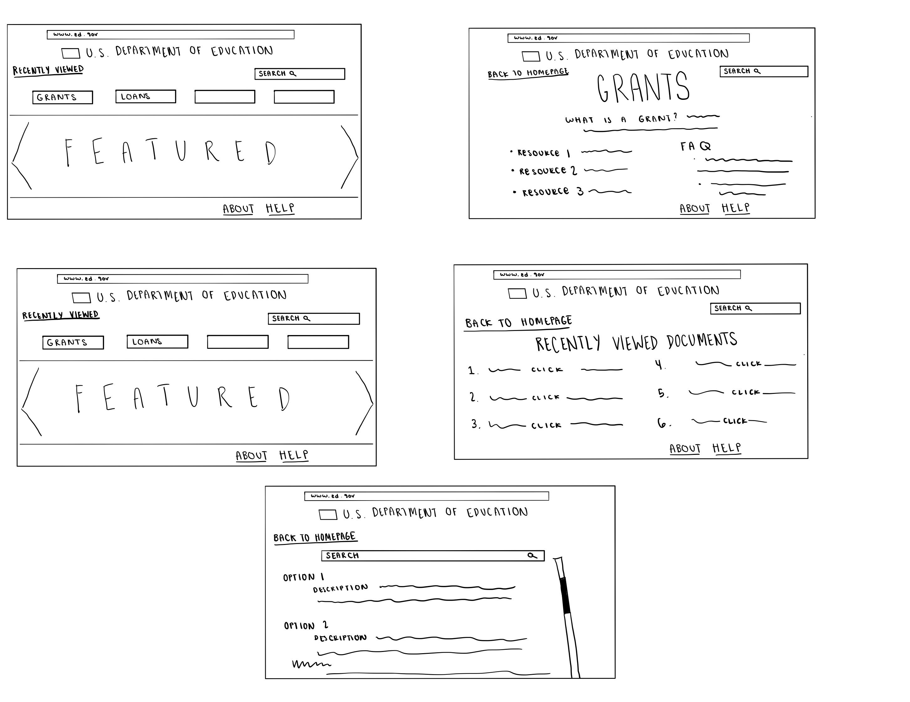

# Low-Fidelity Prototype
## DH 150: Assignment 6 by Natalie Tang

#### Purpose of Low-Fidelity Prototyping
My focus of this project is to improve the design of the U.S. Department of Education wevsite in a way that eliminates current frustrations and difficulties that users may have. This website has the potential to reach a wide audience as a source that provides accurate, reliable information. The typical user could be described as both young or old and is looking for resources/ updates on the education system. The purpose of this low-fidelity prototype is to test how different features on the website flow together while also testing the site's overall functionality. I have chosen to evaluate the Department of Education website on their desktop version as opposed to the mobile version. The extensive amount of information that is provided on the site makes it most suitable for browsers. 

#### Specific Features To Be Addressed
Based on my research in previous assignments, I have chosen three different design problems to fix that are as follows: 

1. The Search Bar -- The U.S. Department of Education provides an overwhelming amount of resources for its users. If users know what they are looking for (through keywords or phrases), then the user can find information more quickly by utilizing the search bar. The search bar can prove even more useful if it can provide the user with autofill suggestions while he or she is entering something into search. 

2. Headings & Layout -- Most people are looking for main headings to guide their experience when visitng a particular website. These need to be placed optimally on the page so that users will be able to notice them and interact with them. Similarly, this relates to the proper layout of the homepage so that the most pressing information is presented to the user from the start. This makes it so that the user does not have to spend unneccesary time searching through the website. 

3. Recently Viewed -- There is a lot of content and resources available on the U.S. Department of Education website. With that being said, it may be difficult for the user to distinguish a source that they have visited from one that they have not visited. Users may also need to refer back to sources that they have previously visited. Providing users with a recently viewed tab will allow them to easily access this information. 

### Wireframes
Search Bar

Headings & Layout

Recently Viewed

### Wireflow
Search Bar

Headings & Layout

Recently Viewed

### Testing
Search Bar

Headings & Layout

Recently Viewed

### Revised Wireframes

### Reflection

The prototype testing went relatively well. The proposed website layout is fairly simple to navigate so the participant was not really confused about any of the pictured features.The user was able to navigate most tasks with ease and only missed a couple of connecting actions.This prototype test was particularly helpful to me because the user was able to identify weak points that I overlooked. The user was able to point out key features on the wireframes that needed to be adjusted because they were confusing and not intuitive. For examle, the user suggested a side bar that would allow the user to easily scroll through the search results. The user pointed out that there are often many search results and that it would be helful if a user can easily scroll from the top to the bottom of the search results. The participant also pointed out an inconsistency on the "recently viewed" wireframes that the recently viewed option was not available at all times which would make it more difficult for the user to know that such a feature exists. Based on this feedback from the user, I adjusted my wireframes to include a scroll bar and a more consistent "recently viewed" option which is pictured above. Next time, I would mention to the particiant to explore all possible connections between each page even if it seems redundant. This will encourage the user to think about how all the parts of a website are working together. 
