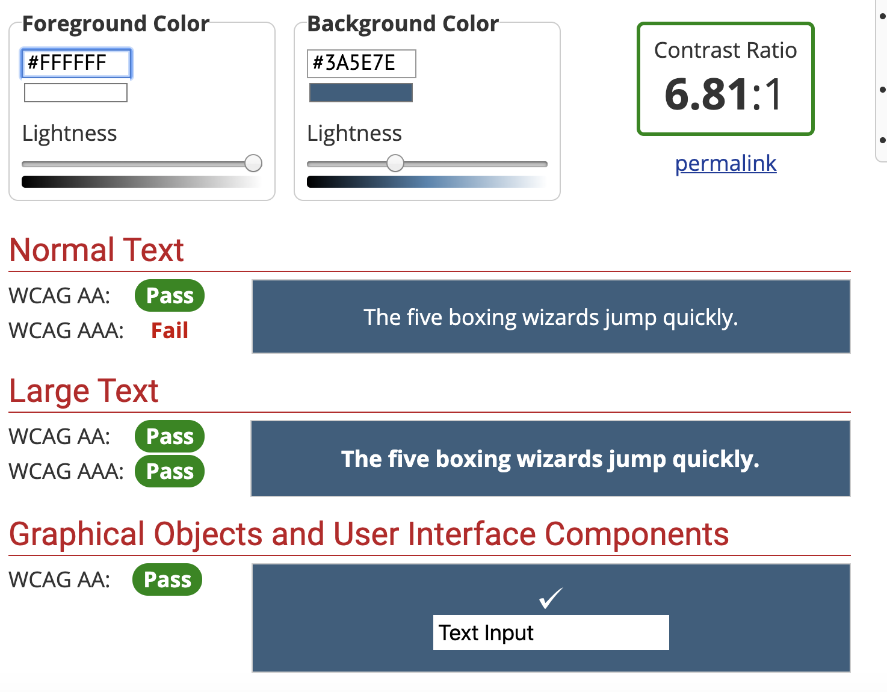
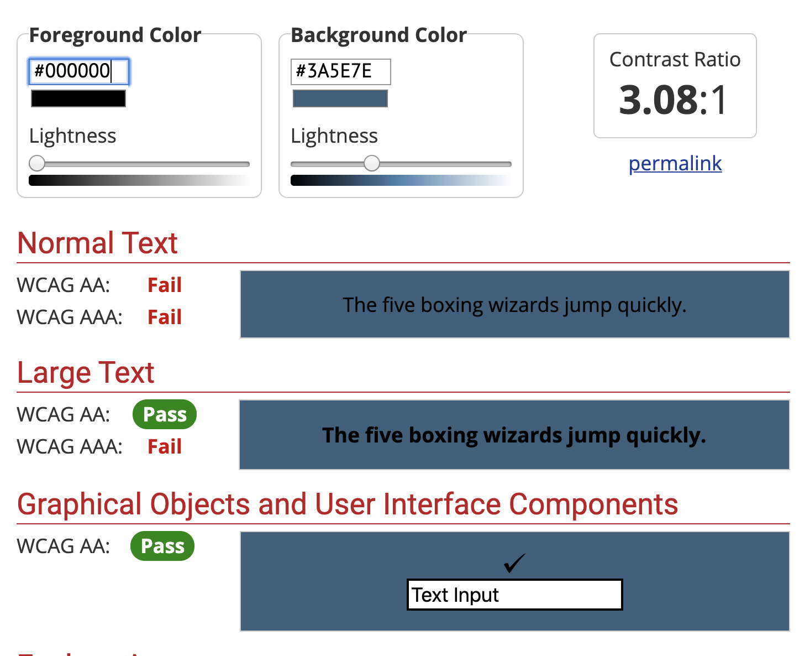

# High Fidelity Prototype
## DH150: Assignment 7 by Natalie Tang

### Description, Process, and Purpose
The following is an interactive, high-fidelity prototype of the U.S. Department of Education website. This prototype was created and developed on Figma. The prototype focuses on three features that are based on the (slightly adjusted)personas of Mikayla Beck, Rosa Torres, and Kristina Lee (refer to Assignment 5). These tasks are detailed further below. 

This prototype is a result of several different steps in the design process. Through the usability test I was able to identify  user interactions that could be improved upon. After this, I created three different personas that adressed the interaction problems based on the characteristics and needs of that persona. I then created a low-fidelity prototype which included hand drawn wireframes and wireflows. I transformed the wireframes of my low-fidelity prototype into a high-fidelity prototype. I was able to further refine my prototype thanks to feedback from my peers. 

The purpose of this interactive, high-fidelity prototype is to visualize the proposed UX/UI related improvements that I would like to make to the U.S. Department of Education website in a format that users can easily and logically navigate. 

### Tasks
Note: I have slightly modified the tasks of my personas so that they are more focused on a specific task.
#### Task 1: Mikayla Beck's Persona
- Using the search bar to quickly and efficiently locate information

In this task, Mikayla, a current undergraduate student, visits the U.S. Department of Education website in hopes of finding resources that will help her journey in applying for graduate school. She immediately navigates to the search bar so that she does not waste any time trying to find these resources manually. In the search bar, Mikayla types "graduate ..." and is immediately provided with suggestionns that appear in the drop down menu. She finds these suggestions helpful and clicks on one named "graduate school resources." A results page appears. This page suggests various resources to Mikayla (ranging from how to afford grad school to stats about all the grad schools in the U.S.). Mikayla is satisfied with these results and is able to explore the search suggestions to learn more about applying into and affording graduate school. 

### Task 2: Rosa Torres's Persona
- Locating information through large, clear headings

In this task, Rosa, an elderly woman, visits the U.S. Department of Education website to find information about how COVID-19 is going to impact her grandchildren's schooling. Rosa starts on the home page of the site and is able to clearly identify a featured heading that reads, "Coronavirus (COVID-19) Information & Updates." Rosa clicks on this featured picture and is redirected to a page that includes updates and resources regarding how the coronavirus has impacted schooling. She is able to see that there are resources specifically for elementary and secondary schools. Rosa clicks on various articles and resources under this heading to educate herself on the coronavirus/school situation. 

### Task 3: Kristina Lee's Persona
- Accessing recently viewed documents 

In this task, Kristina, a mother, is doing some research on the U.S. Department of Education website regarding COVID-19, college statistics, and more. After conducting this research for about two hours, Kristina remembers a specific resoure that she viewed had valuable information about how the Department of Education intends to address the risk of COVID-19 in schools while protecting the civil rights of students. She cannot recall where she found this specific resource. She navigates to the upper right corner to the link named, "recently viewed." Kristina is able to see all the articles/ links that she has visited throughout the day, broken up by hour. She remembers that she found the resource about an hour ago and is able to identify the resource on the "recently viewed" page under the heading "in the past hour." 

### Graphic Designs/ Interactive Prototype

URL Link to prototype: click [here](https://www.figma.com/file/qliJts66TgP4FwwxNc6C2k/Redo?node-id=0%3A1)

#### Task 1: Search Bar Utilization
##### Screen Designs

##### Wireflow With Screen Designs

#### Task 2: Informative, Clear Headings
##### Screen Designs

##### Wireflows With Screen Designs

#### Task 3: Recenly Viewed Documents 
##### Screen Designs

##### Wireflows With Screen Designs

#### Overview

#### Graphical Interface Design Decisions
For the initial re-design of this website I took inspiration from the bones of the current U.S. Department of Education website and expanded on them. One problem with the current site is its lack of a "professional tone." The current site seems extremely plain and disorganized. I liked the use of the color blue on the current site, but I opted for a deeper blue mixed with gray for a more professional tone. I re-designed the top headings to include a drop down menu so that users could more easily navigate to their desired destinations. Additionally, I reorganized the site so that the home page information was naturally separated (through color blocking) and easier for the user to view. 

### Accessibility Test 

 

  

 

### Impression Test 
I conducted an impression test among my fellow DH150 classmates who provided me with useful information that allowed me to completely adjust my vision for the site in the most beneficial way. My initial design of the site was extremely similar to the existing U.S. Department of Education website. Pictured below is my initial prototype that my classmates evaluated.

Based on this initial prototype my classmates suggested/noted the following:
- The site looked very straight-forward and was easy to navigate
- The design looks skeletal, meaning there was still more to develop and more space to fill out on the site
- The headings were not very informative about what information it would lead to 
- The spacing was all over the place
- Headings seemed to clash at the subsections of the site

Based on this feedback, I was able to identify that I needed to increase the professionalism of the site altogether. This would include drop down options for headings, more color (less white space), and a better overall layout. Thank you to Amanda, Jack, & Marina for this useful advice that I was able to use to create a better user experience. 

### Cognitive Walkthrough
A cognitive walkthrough is useful when evaluating the a site's learnability for new users. During this process, evaluators work through a series of tasks and ask questions from the perspective of the user. The cognitive walkthrough went hand-in-hand with the impression test that I mentioned above. I walked my peers through the Kristina Lee's task that involved research and being able to navigate her previously viewed documents. My peers were very interested in this specific tool but were concerned about how it would be laid out/ organized. They generally noted that the site was straight forward and that it was easy to navigate to and from different areas of a given page. 

Based on this feedback, I decided to separate the "recently viewed" page by documents viewed per hour with the option to view pages from up to seven days prior. Additionally, I aimed to keep the site very straight forward by not including any unnecessary features. 

### Reflection 
I was able to learn so much from creating this high fidelity prototype. This project incorporated pretty much all of our previous work and it was cool to see everything come together. At first, I found it quite challenging to use Figma, but overtime I became more and more comfortable with the tool. This was expected for me, especially considering the fact that this is the first time I have done anything related to UX/UI. The most useful thing throughout my creation of a high fidelity prototype was my peers reviewing my prototype. My peers were able to shift my perspective about my entire prototype which inspired me to essentially start over to create a more professional site and one that was not merely "bare bones."

In the future, I would like to conduct more peer reviews as the in-class review proved to be extremely helpful in my case. My re-designed prototype is so different from the one that was initially reviewed by my peers in class. I think it would be beneficial to help further refine the design of my site with additional reviews. I believe that I was able to "fix" everything that my peers suggested to me. More peer review would allow me to adjust the prototype further. 
