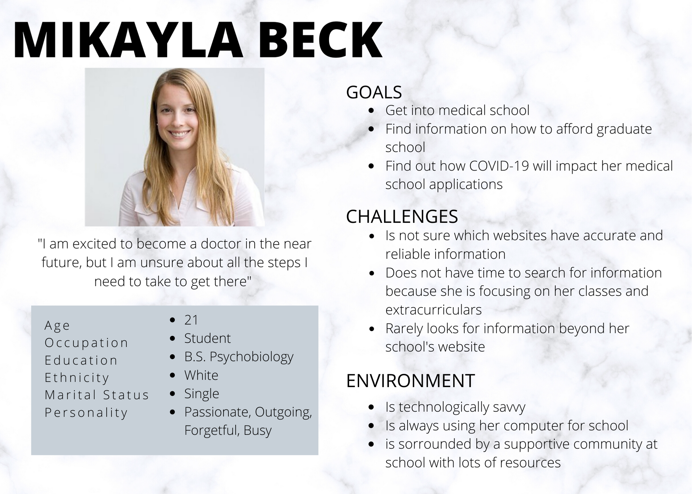
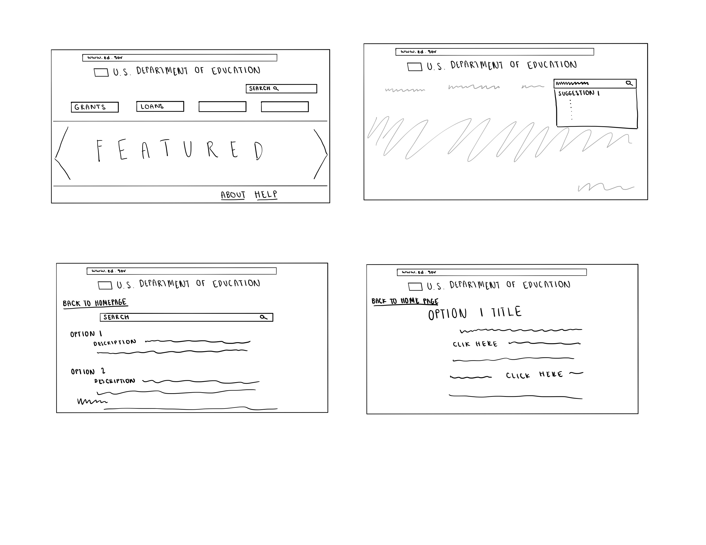
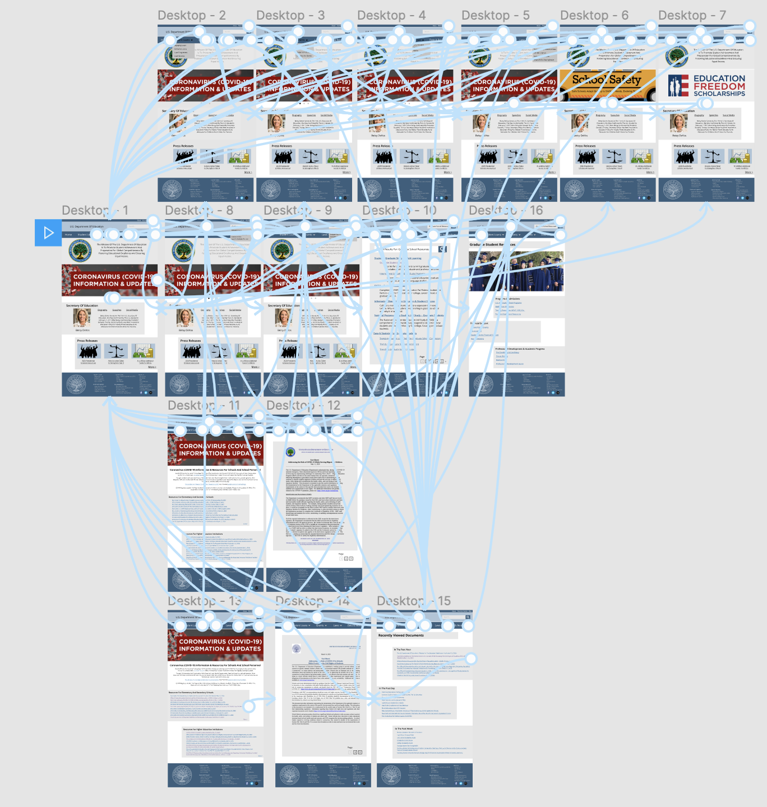

# Public Spaces Impacted by COVID-19: U.S. Department of Education 
## DH150: Assignment 8 by Natalie Tang

## Introduction: a brief information about the project
The coronavirus has profoundly impacted how we interact with the world and has drastically increased the need for online platforms. Now, more than ever, it is important that public websites are both easy to navigate and aesthetically pleasing. In this project, I will propose a new UX design of the U.S Department of Education website that will allow users to navigate the site more easily. Given the ongoing situation, students, teachers, and parents alike are curious about how the coronavirus will impact the future of education on every level (from elementary school to postsecondary school). This would likely increase traffic onto the Department of Education website because people are searching for updates from reliable sources (e.g. government websites). 

## Clear design statement: 
The current design of the U.S. Department of Education website is functional; however, its simplistic design ironically makes it more difficult to efficiently navigate. The website includes a lot of repeated information and while the layout of the site is straightforward, it remains relatively plain which makes a user's experience much less pleasant. The U.S. Department of Eduation acts as a storage platform for all types of information-- news releases, educational data, resources, and more. This can often overwhelm the user, especially if the information is not laid out in a consistent and logical manner. It is crucial for these issues to be resolved so that users do not become frustrated or confused while utilizing the website.  

## Competitor analysis:
To get a sense of how public spaces were presenting information during the coronavirus pandemic I conducted hueristic evaluations on two websites -- the U.S. Department of Education and the Minority Business Development Agency. I chose to analyze these two sites because the education system and small businesses have been havily impacted by COVID-19. Schools across the nation were forced to convert to online learning on short notice and small businesses have suffered dramatically from declining sales and stay-at-home orders that have put operations on hold. By evaluating these two websites I was able to better understand how these sites are able to present a plethora of resources effectively to the public. [... read more >>](https://github.com/nataliejtang/DH150-Natalie-Tang/blob/master/Assignment-1.md)

## User research:
I had a general idea about how people (students, parents, etc.) would traditionally find resources and updates regarding their education -- through educational offices and updates from their own institutions. However, with the changing circumstances, the online dissemination of information has become increasingly important. I needed to learn more about what users needed and wanted from online platforms. I was able to do this by conducting user research with my roommate, a UCLA pre-med student. She offered to give her insights to how she usually finds educational resources and her thought process when visiting websites. The user analyzed the UCLA website, a site she was relatively farmiliar with, and answered questions about how she is finding/not finding resources during the COVID-19 pandemic. [... read more >>](https://github.com/nataliejtang/DH150-Natalie-Tang/blob/master/Assignment-4.md)

## UX storytelling:
It is essential to develop empathy for users to develop a design that is effective and suits the needs of users. To embrace the perspectives and needs of potential users for the U.S. Department of Education website I created multiple personas, scenarios, user journeys, and empathy maps. I created personas from 3 different age categories to emphasize that people of all ages need access to the resources that the Department of Education has to offer and need to be able to navigate efficiently. These personas and stories help keep the design focused on the user and helped me throughought the remainder of the design process.
 
 
 [... read more >>](https://github.com/nataliejtang/DH150-Natalie-Tang/blob/master/Assignment-5.md)
 

## Wireframe and Graphic Design:
The perspective of the personas I created allowed me to incorporate three different features into my website that I deemed valuable for users:

1. Searchability through the search bar in a way that displays information intuitively
2. Clear headings and an organized homepage that would help users navigate the plethora of resources
3. The creation of a "recently viewed" tab to help organize the mass amounts of information that users are bombarded with

Based off of these focus points, I began sketching out scenarios and wireframs that would address these points. 

## Low-fidelity prototype (wireflow, assignment06)
The low-fidelity prototype allowed me to test how different features on the website will flow together while also testing the site's overall functionality. I focused on the three tasks that I mentioned previously that will allow users to easily find coronavirus updates as well as general educational resources.  [... read more >>](https://github.com/nataliejtang/DH150-Natalie-Tang/blob/master/Assignment-6.md) 

## High-fidelity prototype (functional/interactive prototype, assignment08)
Following the creation of my low-fidelity prototype, I developed an interactive, high-fidelity prototype of the U.S. Department of Education website. I created and developed this prototype on Figma. I realized that my low-fidelity prototype did not nearly go into enough detail about how I wanted the site to function. As a result, my high-fidelity prototype looks much different than my wireframes and wireflow. This helped me envision what the end product would look like and would allow me to test the effectiveness of the prototype among users. [... read more >>](https://github.com/nataliejtang/DH150-Natalie-Tang/blob/master/Assignment-7.md) 

 

## Pitch video 

## Conclusion: what did you learn throughout the process?
I have learned so much throughout this design process. It is crucial that the user is kept in mind every step of the way because they will be the ones that need to be able to interact with the site and find information. It is important to incorporate different user tests and ask users how they feel about X, Y, and Z. As a designer, input from other people is so important because it is easy to become blind to potential problems after working on a specific project for extended periods of time. Above all, I learned that revision is a part of the process. When I was developing my high-fidelity prototype I realized that my low-fidelity prototype was far from what I wanted it to be. Instead of keeping the user in mind, I had just modeled the low-fidelity prototype off of the pre-existing website instead of creating a more functional version. This is why the input of others is so important. My peers were able to recognize the plainness of the prototype in time for me to make the necessary adjustments for a usable prototype. I do not know everything about UX/UI Design, but taking one step at a time (through each assignment) allowed me to better understand the design process and grow in my design abilities along the way.
